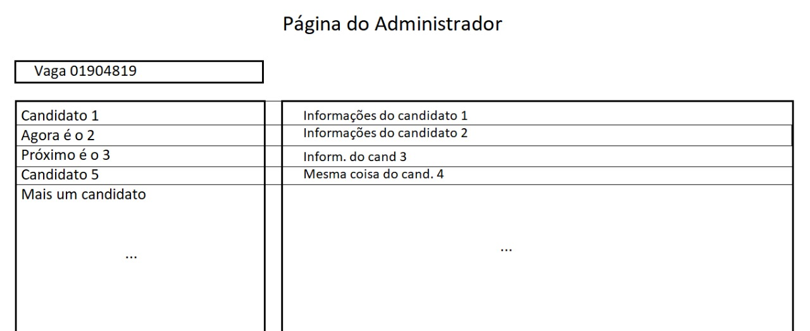
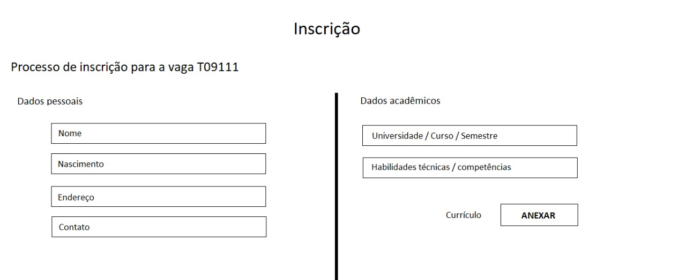
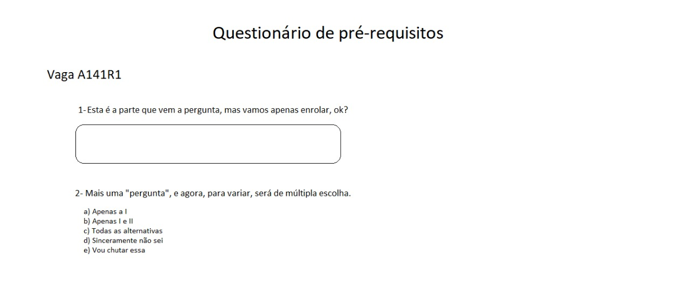

# Documento de Visão do Projeto "Sistema de Seleção"

Este documento apresenta uma solução de software para o projeto *Sistema de Seleção*, solicitado pelo cliente *Ipioca*, 
apresentando os problemas a serem solucionados, as necessidades dos principais envolvidos, o alcance do projeto e as funcionalidades esperadas do sistema.

## Objetivos

* Facilitar o processo de seleção da empresa
* Deixar o processo de seleção mais dinâmico
* Avaliar o maior número de candidatos possíveis
* Realizar testes online pré entrevista individual
* Deixar o processo seletivo mais barato

## Problema

* Descrição do problema: O processo de seleção atual da empresa Ipioca é muito demorado e nem sempre seleciona os melhores candidatos possiveis, portanto deseja criar uma plataforma para facilitar essa seleção e abranger o maior númeor de pessoas com testes e currículos online, para assim selecionar os candidatos certos para uma entrevista pessoal.
* Quem é afetado pelo problema: Os funcionários de RH da empresa, os quais são responsáveis pelo processo de seleção e os candidatos para vagas.
* Impacto no negócio: Com esse sistema o processo seletivo o processo será mais rápido e barato, facilitando o processo de seleção e abrangendo o maior número de candidatos
* Benefícios de uma boa solução: com uma boa solução o sistema ficará mais barato e beneficiará os usuários. Além disso teria uma maior agilidade no processo de seleção, permitindo a avaliação do maior número de candidatos possíveis e otimizando o tempo gasto na avaliação do perfil de candidatos. 

## Definições, abreviações e outros termos do domínio do problema

* RN - Regras de Negócio
* FA - Fluxo Alternativo.
* FE - Fluxo de Exceção.

## Integração com outros sistemas

* Integração com o sistema de Email
 
## Interessados

* Gerente de Projeto
* Avaliador
* Administrador
* Departamento de RH

## Usuários

* Administrador do sistema 
* Avaliador
* Candidato para vaga

## Funcionalidades do produto

* Cadastrar currículo
* Realizar teste online
* Avaliador poder avaliar todos os candidatos com seus respectivos currículos e testes
* Enviar email para o candidato
* Fornecer uma chave para os candidatos acessarem o sistema
* Cadastrar teste online, com questões de múltipla escolha

## Restrições do projeto

* Responsivo apenas para paginas web desktop.
* Programação em HTML5, CSS, JavaScript e integração com banco de dados MySQL, utilizando PHP.
* Cada questão terá no máximo 5 alternativas.

## Protótipos de tela

### Protótipos para funcionalidade 1

Fonte: Exemplos gerados pelo assistente do **Enterprise Architect**.

### Protótipos para Inscrição em uma vaga

Fonte: Exemplos gerados pelo assistente do **Enterprise Architect**.

### Protótipos para Questionário

