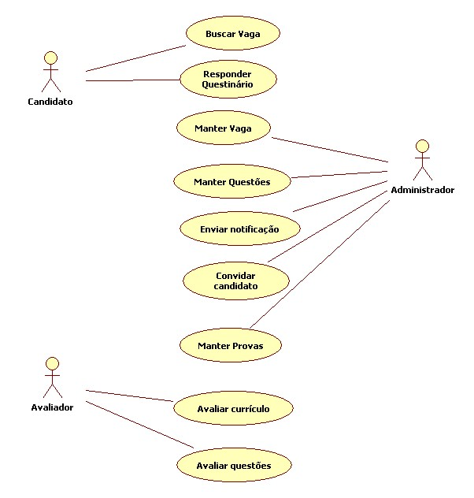

# Casos de uso

## 1. Diagrama de casos de uso

  

**Instruções do professor**: Insira abaixo o diagrama com os casos de uso do seu sistema. A imagem abaixo é somente um exemplo.

## 2. Especificação dos casos de uso

### 2.1. Caso de uso **Convidar Condidato**

| Campo          | Informação        |
|---|---|
| Identificador: | CU01              |
| Nome:          | Buscar vaga |
| Atores:        | Candidato |
| Sumário:       | Busca uma vaga dentro do nosso sistema. |

| Fluxo Principal |
|---|
| 1) O candidato entra no sistema e aparecem as vagas disponíveis. |
| 2) O candidato seleciona a vaga desejada. |
| 3) O candidato cadastra  seu currículo no sistema. |
| 4) O candidato faz o questionário. |

| Fluxo Alternativo (2a): vaga desejada indisponível. |
|---|
| 1) O candidato não encontra uma vaga desejada. |
| 2) O candidato deixa sua sugestão para inclusão da vaga em um campo específico. |

### 2.1. Caso de uso **Responder questinário**

| Campo          | Informação        |
|---|---|
| Identificador: | CU02              |
| Nome:          | Responder questinário |
| Atores:        | Candidato |
| Sumário:       | O candidato responde ao questionário oferecido. |

| Fluxo Principal |
|---|
| 1) O candidato após ter cadastrado seu currículo vai para a página do questionário. |
| 2) O candidato responde todas as questões do questionário. |
| 3) O candidato envia suas respostas para o sistema. |

| Fluxo Alternativo (3a): candidato não responde todas as questões. |
|---|
| 1) O sistema sinaliza o candidato que é necessário responder todas as questões. |
| 2) O sistema volta para o passo (2) no do fluxo principal. |

### 2.6. Caso de uso **Convidar Condidato**

| Campo          | Informação        |
|---|---|
| Identificador: | CU08              |
| Nome:          | Convidar candidato |
| Atores:        | Administrador |
| Sumário:       | Convida o candidato para po sistema |

| Fluxo Principal |
|---|
| 1) O administrador entra no menu **Convidar Condidato**. |
| 2) O sistema gera uma chave de login. |
| 3) O administrador insere o email do candidato. |
| 4) O admnistrador envia a chave para o email do candidato. |

| Fluxo Alternativo (4a): O email do usuário é inválido. |
|---|
| 1) O sistema mostra uma mensagem de email inválido. |
| 2) Volta para o passo (3) do fluxo principal. |

### 2.3. Caso de uso **CRUD Vaga**
 FALTA FAZER ESSE
| Campo          | Informação        |
|---|---|
| Identificador: | CU02              |
| Nome:          | Responder questinário |
| Atores:        | Candidato |
| Sumário:       | O candidato responde ao questionário oferecido. |

| Fluxo Principal |
|---|
| 1) O candidato após ter cadastrado seu currículo vai para a página do questionário. |
| 2) O candidato responde todas as questões do questionário. |
| 3) O candidato envia suas respostas para o sistema. |

| Fluxo Alternativo (3a): candidato não responde todas as questões. |
|---|
| 1) O sistema sinaliza o candidato que é necessário responder todas as questões. |
| 2) O sistema volta para o passo (2) no do fluxo principal. |

### 2.8. Caso de uso **Avaliar Testes**

| Campo          | Informação        |
|---|---|
| Identificador: | CU07              |
| Nome:          | Avaliar testes |
| Atores:        | Avaliador |
| Sumário:       | Avalia os testes dos candidatos |

| Fluxo Principal |
|---|
| 1) O avaliador entra no menu **Testes dos candidatos**. |
| 2) O avaliador vê a correção das questões de múltipla escolha e avalia as dissertativas. |
| 3) O avaliador da um nota para o candidato. |

